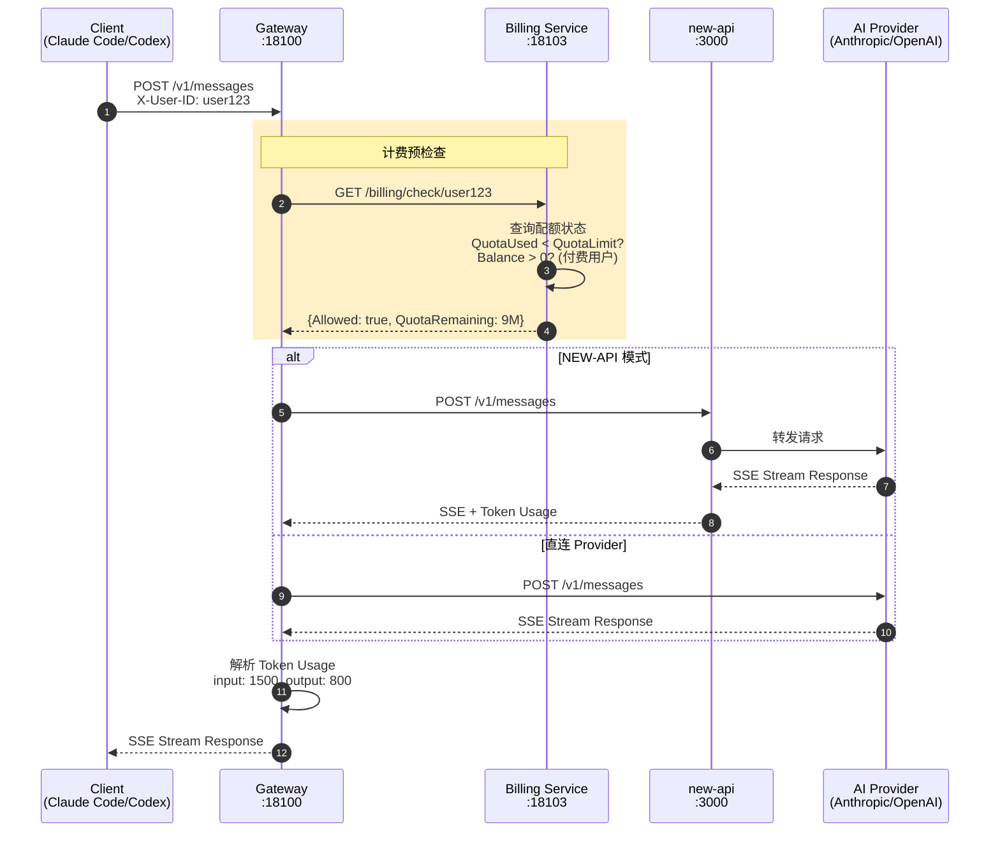
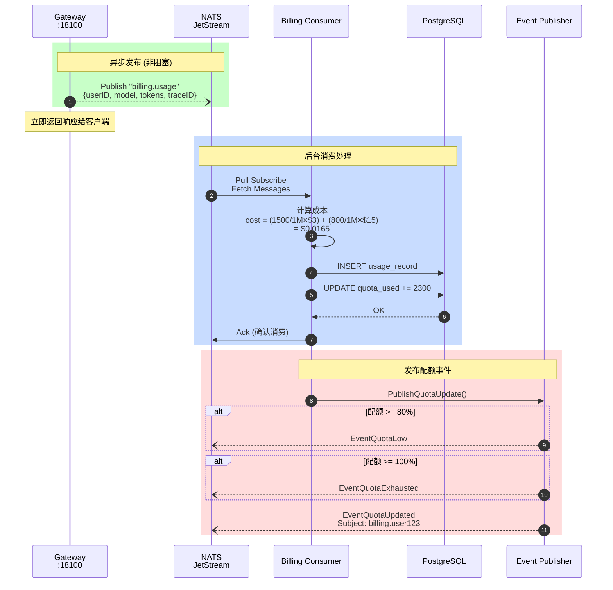
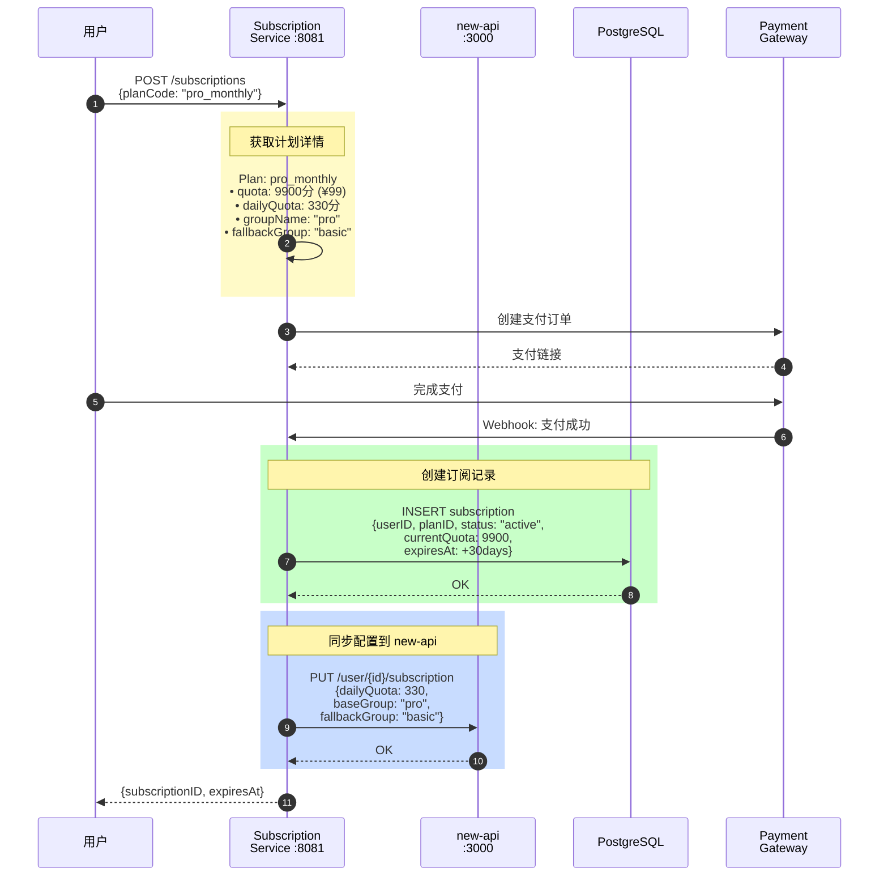
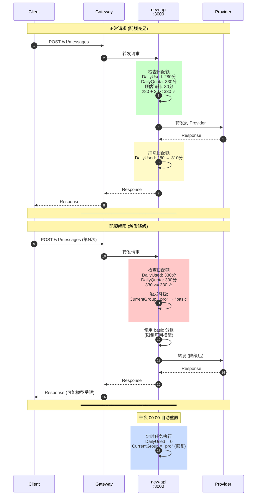
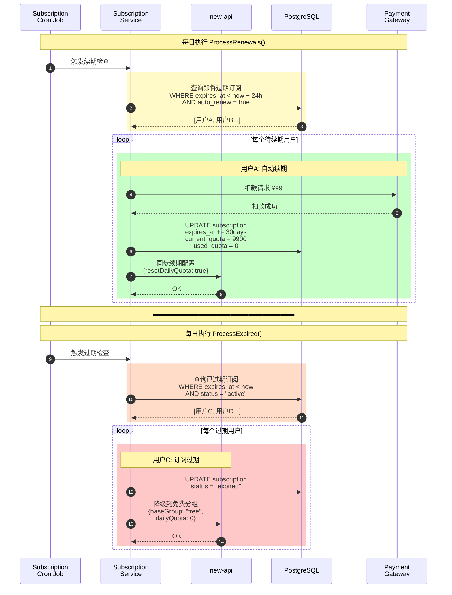
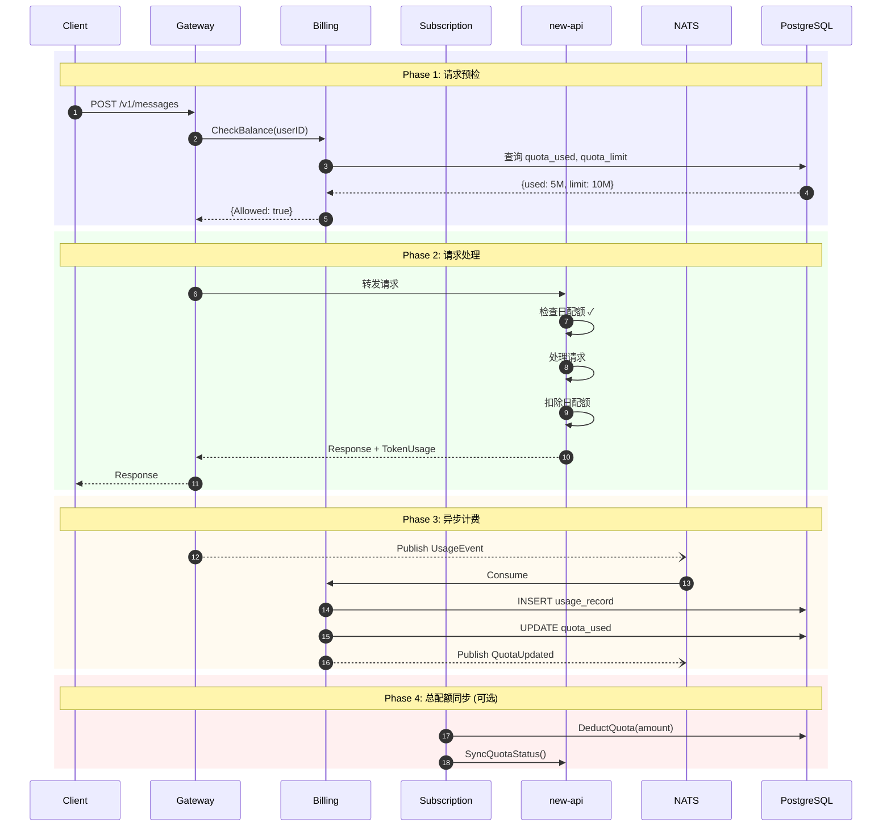

# Lurus Switch 计费系统数据流转文档
# Lurus Switch Billing System Data Flow Documentation

> 本文档详细描述服务流程、金额扣除机制、以及包年包月会员积分使用方式。
> This document details the service flow, billing deduction mechanism, and subscription quota usage.

---

## 目录 / Table of Contents

1. [系统架构总览](#1-系统架构总览)
2. [请求处理与计费检查流程](#2-请求处理与计费检查流程)
3. [异步计费记录流程](#3-异步计费记录流程)
4. [订阅购买与配置同步](#4-订阅购买与配置同步)
5. [日配额扣除与降级机制](#5-日配额扣除与降级机制)
6. [订阅续期与过期处理](#6-订阅续期与过期处理)
7. [完整数据流总览](#7-完整数据流总览)
8. [计费规则说明](#8-计费规则说明)

---

## 1. 系统架构总览

### 1.1 服务拓扑图

```
┌─────────────────────────────────────────────────────────────────────────────┐
│                              Client Layer                                    │
├─────────────────┬─────────────────┬─────────────────┬───────────────────────┤
│   Mobile App    │   GUI Client    │   TUI Client    │    Admin Console      │
│   (Flutter)     │   (Wails 3)     │  (gemini-cli)   │    (Vue 3)            │
│                 │   CodeSwitch    │   claude-code   │    /admin/*           │
└────────┬────────┴────────┬────────┴────────┬────────┴───────────┬───────────┘
         │                 │                 │                    │
         └─────────────────┴─────────────────┴────────────────────┘
                                   │
                   ┌───────────────▼───────────────┐
                   │         Gateway Service        │
                   │            :18100              │
                   │    (Entry Point + Billing)     │
                   └───────────────┬───────────────┘
                                   │
        ┌──────────────────────────┼──────────────────────────┐
        │                          │                          │
        ▼                          ▼                          ▼
┌─────────────────┐    ┌─────────────────────┐    ┌─────────────────────┐
│ Billing Service │    │ Subscription Service│    │      new-api        │
│     :18103      │    │       :8081         │    │       :3000         │
│  (Usage Record) │    │  (Plan & Quota)     │    │  (Daily Quota)      │
└────────┬────────┘    └──────────┬──────────┘    └──────────┬──────────┘
         │                        │                          │
         └────────────────────────┼──────────────────────────┘
                                  │
                   ┌──────────────▼──────────────┐
                   │       NATS JetStream        │
                   │      (Event Message Bus)    │
                   └──────────────┬──────────────┘
                                  │
                   ┌──────────────▼──────────────┐
                   │        PostgreSQL           │
                   │    (Persistent Storage)     │
                   └─────────────────────────────┘
```

### 1.2 两层配额管理架构

```
┌────────────────────────────────────────┐
│  Subscription Service (总配额管理)      │
│  ├─ 按月重置的订阅总配额                │
│  ├─ 支持多用户并发 deduct              │
│  └─ 存储在 PostgreSQL                  │
└────────────────────┬───────────────────┘
                     │ UpdateUserSubscriptionConfig
                     │ (DailyQuota, BaseGroup, ...)
                     ▼
┌────────────────────────────────────────┐
│  new-api (日配额状态管理，真实数据源)    │
│  ├─ 按天重置的日配额                    │
│  ├─ 模型分组管理 (pro/basic/free)      │
│  ├─ 降级逻辑（超出日限→fallback）      │
│  └─ 内存或 Redis 存储                  │
└────────────────────────────────────────┘
```

---

## 2. 请求处理与计费检查流程

### 2.1 序列图



### 2.2 ASCII 流程图

```
┌──────────┐    ┌─────────────┐    ┌────────────────┐    ┌─────────────┐    ┌─────────┐
│  Client  │    │   Gateway   │    │ Billing Service│    │   new-api   │    │ Provider│
│(Claude/  │    │   :18100    │    │    :18103      │    │   :3000     │    │(Anthropic│
│ Codex)   │    │             │    │                │    │             │    │ OpenAI) │
└────┬─────┘    └──────┬──────┘    └───────┬────────┘    └──────┬──────┘    └────┬────┘
     │                 │                   │                    │                │
     │ POST /v1/messages                   │                    │                │
     │ X-User-ID: user123                  │                    │                │
     ├────────────────>│                   │                    │                │
     │                 │                   │                    │                │
     │                 │ GET /billing/check/user123             │                │
     │                 ├──────────────────>│                    │                │
     │                 │                   │                    │                │
     │                 │                   │ 查询用户配额        │                │
     │                 │                   ├──┐                 │                │
     │                 │                   │  │ QuotaUsed < QuotaLimit?          │
     │                 │                   │  │ Balance > 0? (付费用户)          │
     │                 │                   │<─┘                 │                │
     │                 │                   │                    │                │
     │                 │ {Allowed: true, QuotaRemaining: 9M}    │                │
     │                 │<──────────────────┤                    │                │
     │                 │                   │                    │                │
     │        ┌────────┴────────┐          │                    │                │
     │        │ 选择转发目标:    │          │                    │                │
     │        │ • NEW-API模式   │          │                    │                │
     │        │ • 直连Provider  │          │                    │                │
     │        └────────┬────────┘          │                    │                │
     │                 │                   │                    │                │
     │                 │ POST /v1/messages (NEW-API模式)        │                │
     │                 ├───────────────────────────────────────>│                │
     │                 │                   │                    │                │
     │                 │                   │                    │ POST (转发)    │
     │                 │                   │                    ├───────────────>│
     │                 │                   │                    │                │
     │                 │                   │                    │   SSE Stream   │
     │                 │                   │                    │<───────────────┤
     │                 │                   │                    │                │
     │                 │        SSE Stream (含 token usage)     │                │
     │                 │<───────────────────────────────────────┤                │
     │                 │                   │                    │                │
     │  SSE Stream     │                   │                    │                │
     │<────────────────┤                   │                    │                │
     │                 │                   │                    │                │
     │                 │ 解析 usage:       │                    │                │
     │                 │ input: 1500       │                    │                │
     │                 │ output: 800       │                    │                │
```

### 2.3 检查逻辑说明

| 检查项 | 条件 | 结果 |
|--------|------|------|
| 配额检查 | `QuotaUsed >= QuotaLimit` | 拒绝 (402) |
| 余额检查 | `Plan != "free" && Balance <= 0` | 拒绝 (402) |
| 通过检查 | 以上条件均不满足 | 允许继续 |

---

## 3. 异步计费记录流程

### 3.1 序列图



### 3.2 ASCII 流程图

```
┌─────────────┐    ┌─────────────┐    ┌────────────────┐    ┌──────────────┐
│   Gateway   │    │    NATS     │    │ Billing Service│    │  PostgreSQL  │
│   :18100    │    │  JetStream  │    │   Consumer     │    │   Database   │
└──────┬──────┘    └──────┬──────┘    └───────┬────────┘    └──────┬───────┘
       │                  │                   │                    │
       │ Publish "billing.usage"             │                    │
       │ {                │                   │                    │
       │   userID,        │                   │                    │
       │   model,         │                   │                    │
       │   inputTokens,   │                   │                    │
       │   outputTokens,  │                   │                    │
       │   provider,      │                   │                    │
       │   traceID        │                   │                    │
       │ }                │                   │                    │
       ├─────────────────>│                   │                    │
       │                  │                   │                    │
       │  (异步，不阻塞)   │ Pull Subscribe    │                    │
       │                  │ "billing.usage"   │                    │
       │                  │<──────────────────┤                    │
       │                  │                   │                    │
       │                  │ Fetch Messages    │                    │
       │                  ├──────────────────>│                    │
       │                  │                   │                    │
       │                  │                   │ RecordUsage()      │
       │                  │                   ├──┐                 │
       │                  │                   │  │ 计算成本:       │
       │                  │                   │  │ cost = (1500/1M × $3)
       │                  │                   │  │      + (800/1M × $15)
       │                  │                   │  │      = $0.0165   │
       │                  │                   │<─┘                 │
       │                  │                   │                    │
       │                  │                   │ INSERT usage_record│
       │                  │                   ├───────────────────>│
       │                  │                   │                    │
       │                  │                   │ UPDATE quota_used  │
       │                  │                   │ += 2300 tokens     │
       │                  │                   ├───────────────────>│
       │                  │                   │                    │
       │                  │                   │         OK         │
       │                  │                   │<───────────────────┤
       │                  │                   │                    │
       │                  │       Ack         │                    │
       │                  │<──────────────────┤                    │
```

### 3.3 NATS 事件类型

| 事件类型 | Subject | 触发条件 | 用途 |
|----------|---------|----------|------|
| `quota.updated` | `billing.{userID}` | 每次使用记录 | 通知客户端更新 |
| `quota.low` | `billing.{userID}` | 配额 >= 80% | 预警通知 |
| `quota.exhausted` | `billing.{userID}` | 配额 >= 100% | 用尽通知 |
| `usage.recorded` | `billing.usage` | 每次使用记录 | 审计日志 |

---

## 4. 订阅购买与配置同步

### 4.1 序列图



### 4.2 ASCII 流程图

```
┌──────────┐   ┌─────────────────┐   ┌─────────────┐   ┌─────────────┐
│  用户    │   │ Subscription    │   │   new-api   │   │  PostgreSQL │
│ 购买订阅 │   │ Service :8081   │   │   :3000     │   │   Database  │
└────┬─────┘   └───────┬─────────┘   └──────┬──────┘   └──────┬──────┘
     │                 │                    │                 │
     │ POST /subscriptions                  │                 │
     │ {planCode: "pro_monthly"}            │                 │
     ├────────────────>│                    │                 │
     │                 │                    │                 │
     │                 │ 获取计划详情        │                 │
     │                 ├──┐                 │                 │
     │                 │  │ Plan:           │                 │
     │                 │  │ • quota: 9900分 (¥99)             │
     │                 │  │ • dailyQuota: 330分 (¥3.3/天)     │
     │                 │  │ • groupName: "pro"                │
     │                 │  │ • fallbackGroup: "basic"          │
     │                 │<─┘                 │                 │
     │                 │                    │                 │
     │                 │ 创建订阅记录        │                 │
     │                 ├─────────────────────────────────────>│
     │                 │ INSERT subscription                  │
     │                 │ {                  │                 │
     │                 │   userID,          │                 │
     │                 │   planID,          │                 │
     │                 │   status: "active",│                 │
     │                 │   currentQuota: 9900,                │
     │                 │   expiresAt: +30days                 │
     │                 │ }                  │                 │
     │                 │                    │                 │
     │                 │ 同步配置到 new-api  │                 │
     │                 │ PUT /user/{id}/subscription          │
     │                 ├───────────────────>│                 │
     │                 │ {                  │                 │
     │                 │   dailyQuota: 330, │                 │
     │                 │   baseGroup: "pro",│                 │
     │                 │   fallbackGroup: "basic"             │
     │                 │ }                  │                 │
     │                 │                    │                 │
     │                 │        OK          │                 │
     │                 │<───────────────────┤                 │
     │                 │                    │                 │
     │ {subscriptionID, expiresAt}          │                 │
     │<────────────────┤                    │                 │
```

---

## 5. 日配额扣除与降级机制

### 5.1 序列图



### 5.2 ASCII 流程图

```
┌──────────┐   ┌─────────────┐   ┌─────────────┐   ┌─────────────────┐
│  Client  │   │   new-api   │   │   Gateway   │   │ Subscription    │
│          │   │   :3000     │   │   :18100    │   │ Service :8081   │
└────┬─────┘   └──────┬──────┘   └──────┬──────┘   └───────┬─────────┘
     │                │                 │                  │
     │                │                 │                  │
     │  用户每日使用流程 (日配额管理在 new-api)              │
     │                │                 │                  │
     │ POST /v1/messages                │                  │
     ├───────────────────────────────>│                  │
     │                │                 │                  │
     │                │ 转发请求        │                  │
     │                │<────────────────┤                  │
     │                │                 │                  │
     │                │ 检查日配额       │                  │
     │                ├──┐              │                  │
     │                │  │ DailyUsed: 280分                │
     │                │  │ DailyQuota: 330分               │
     │                │  │ 本次预估: 30分                   │
     │                │  │                │                  │
     │                │  │ 280 + 30 < 330 ✓                │
     │                │<─┘              │                  │
     │                │                 │                  │
     │                │ 处理请求并扣除   │                  │
     │                ├──┐              │                  │
     │                │  │ DailyUsed += 实际消耗            │
     │                │  │ DailyUsed: 310分                │
     │                │<─┘              │                  │
     │                │                 │                  │
     │       响应     │                 │                  │
     │<───────────────┴─────────────────┤                  │
     │                                  │                  │
═══════════════════════════════════════════════════════════════════
     │                                  │                  │
     │  当日配额超出时的降级流程          │                  │
     │                                  │                  │
     │ POST /v1/messages (第N次请求)    │                  │
     ├───────────────────────────────>│                  │
     │                │                 │                  │
     │                │<────────────────┤                  │
     │                │                 │                  │
     │                │ 检查日配额       │                  │
     │                ├──┐              │                  │
     │                │  │ DailyUsed: 330分                │
     │                │  │ DailyQuota: 330分               │
     │                │  │                │                  │
     │                │  │ 330 >= 330 ⚠️ 触发降级          │
     │                │  │                │                  │
     │                │  │ CurrentGroup: "pro" → "basic"   │
     │                │<─┘              │                  │
     │                │                 │                  │
     │                │ 使用 basic 分组处理                 │
     │                │ (限制可用模型)   │                  │
     │                ├──┐              │                  │
     │                │  │ 只能访问基础模型                 │
     │                │  │ 无法使用 opus/sonnet             │
     │                │<─┘              │                  │
     │                │                 │                  │
     │  响应 (降级后)  │                 │                  │
     │<───────────────┴─────────────────┤                  │
```

### 5.3 降级规则

| 原分组 | 降级后分组 | 可用模型 |
|--------|------------|----------|
| `premium` | `pro` | Claude Sonnet, GPT-4 |
| `pro` | `basic` | Claude Haiku, GPT-3.5 |
| `basic` | `free` | 基础模型 |
| `free` | - | 拒绝请求 |

---

## 6. 订阅续期与过期处理

### 6.1 序列图



### 6.2 ASCII 流程图

```
┌─────────────────┐   ┌─────────────┐   ┌─────────────┐   ┌──────────────┐
│ Subscription    │   │   new-api   │   │   Payment   │   │  PostgreSQL  │
│ Service (Cron)  │   │   :3000     │   │   Gateway   │   │   Database   │
└───────┬─────────┘   └──────┬──────┘   └──────┬──────┘   └──────┬───────┘
        │                    │                 │                 │
        │ ProcessRenewals() - 每日执行          │                 │
        ├──┐                 │                 │                 │
        │  │ 查找即将过期的订阅                 │                 │
        │  │ WHERE expires_at < now + 24h      │                 │
        │  │ AND auto_renew = true             │                 │
        │<─┘                 │                 │                 │
        │                    │                 │                 │
        │                    │                 │                 │
        │ 用户A: 自动续期 (auto_renew=true)     │                 │
        ├────────────────────────────────────>│                 │
        │ 扣款请求           │                 │                 │
        │                    │                 │                 │
        │                    │        扣款成功  │                 │
        │<────────────────────────────────────┤                 │
        │                    │                 │                 │
        │ UPDATE subscription                  │                 │
        │ SET expires_at += 30days,            │                 │
        │     current_quota = plan.quota,      │                 │
        │     used_quota = 0                   │                 │
        ├─────────────────────────────────────────────────────>│
        │                    │                 │                 │
        │ 同步续期配置到 new-api               │                 │
        ├───────────────────>│                 │                 │
        │ {resetDailyQuota}  │                 │                 │
        │                    │                 │                 │
═════════════════════════════════════════════════════════════════════
        │                    │                 │                 │
        │ ProcessExpired() - 处理过期订阅      │                 │
        ├──┐                 │                 │                 │
        │  │ 查找已过期订阅  │                 │                 │
        │  │ WHERE expires_at < now            │                 │
        │  │ AND status = "active"             │                 │
        │<─┘                 │                 │                 │
        │                    │                 │                 │
        │ 用户B: 订阅过期    │                 │                 │
        │                    │                 │                 │
        │ UPDATE subscription                  │                 │
        │ SET status = "expired"               │                 │
        ├─────────────────────────────────────────────────────>│
        │                    │                 │                 │
        │ 降级用户到免费分组  │                 │                 │
        ├───────────────────>│                 │                 │
        │ PUT /user/{id}/subscription          │                 │
        │ {                  │                 │                 │
        │   baseGroup: "free",                 │                 │
        │   dailyQuota: 0,   │                 │                 │
        │   fallbackGroup: ""│                 │                 │
        │ }                  │                 │                 │
```

---

## 7. 完整数据流总览

### 7.1 完整请求生命周期



### 7.2 数据流总览图

```
┌─────────────────────────────────────────────────────────────────────────────┐
│                              数据流总览                                      │
└─────────────────────────────────────────────────────────────────────────────┘

                          ┌───────────────────┐
                          │     用户请求       │
                          │  POST /v1/messages │
                          └─────────┬─────────┘
                                    │
                                    ▼
┌───────────────────────────────────────────────────────────────────────────┐
│                         Gateway Service :18100                             │
│  ┌─────────────────┐    ┌─────────────────┐    ┌─────────────────┐        │
│  │ 1. 预检查余额    │───>│ 2. 选择Provider  │───>│ 3. 转发请求     │        │
│  │ BillingCheck    │    │ 或 NEW-API      │    │ 记录 Token 数   │        │
│  └─────────────────┘    └─────────────────┘    └────────┬────────┘        │
└────────────────────────────────────────────────────────┬──────────────────┘
         │                                               │
         │ GET /billing/check                            │ Publish
         ▼                                               ▼
┌─────────────────────┐                      ┌─────────────────────┐
│  Billing Service    │                      │    NATS JetStream   │
│      :18103         │                      │     Message Bus     │
│                     │◄─────────────────────│                     │
│ • 检查配额/余额      │   Subscribe          │ • billing.usage     │
│ • 记录使用详情       │   "billing.usage"    │ • billing.{userID}  │
│ • 发布配额事件       │                      │                     │
└─────────┬───────────┘                      └─────────────────────┘
          │
          │ 配额不足时
          │ 触发警告
          ▼
┌─────────────────────────────────────────────────────────────────────────────┐
│                        两层配额管理架构                                       │
│                                                                             │
│  ┌─────────────────────────────┐    ┌─────────────────────────────┐        │
│  │  Subscription Service :8081 │    │       new-api :3000         │        │
│  │                             │    │                             │        │
│  │  总配额管理 (月度)           │───>│  日配额管理 (每日)           │        │
│  │  • CurrentQuota: 9900分     │同步 │  • DailyQuota: 330分        │        │
│  │  • UsedQuota: 累计使用       │    │  • DailyUsed: 今日已用       │        │
│  │  • 订阅续期/过期处理         │    │  • 分组降级逻辑              │        │
│  │                             │    │                             │        │
│  │  PostgreSQL 持久化           │    │  内存/Redis 实时管理         │        │
│  └─────────────────────────────┘    └─────────────────────────────┘        │
│                                                                             │
└─────────────────────────────────────────────────────────────────────────────┘
```

### 7.3 数据流转汇总表

| 阶段 | 触发点 | 数据流向 | 存储位置 |
|------|--------|----------|----------|
| **预检查** | 每次请求 | Gateway → Billing | Redis 缓存 |
| **日配额扣除** | 请求处理时 | new-api 内部 | 内存/Redis |
| **使用记录** | 请求完成后 | Gateway → NATS → Billing → DB | PostgreSQL |
| **总配额扣除** | 定期同步 | Subscription → DB | PostgreSQL |
| **配额重置** | 每日 00:00 | new-api Cron | 内存/Redis |
| **订阅续期** | 每日检查 | Subscription Cron → DB → new-api | PostgreSQL |

---

## 8. 计费规则说明

### 8.1 订阅计划

| 计划 | 月费 | 总配额 | 日配额 | 分组 | 降级分组 |
|------|------|--------|--------|------|----------|
| Free | ¥0 | 500分 | 无限制 | `free` | - |
| Basic Monthly | ¥29 | 2900分 | 100分 | `basic` | `free` |
| Pro Monthly | ¥99 | 9900分 | 330分 | `pro` | `basic` |
| Enterprise | ¥299 | 29900分 | 1000分 | `premium` | `pro` |

### 8.2 Token 成本计算

```
成本 = (输入Token / 1M × $3.0) + (输出Token / 1M × $15.0)

示例:
- 输入: 1500 tokens
- 输出: 800 tokens
- 成本 = (1500/1000000 × 3.0) + (800/1000000 × 15.0)
       = 0.0045 + 0.012
       = $0.0165
```

### 8.3 配额扣除逻辑

| 层级 | 服务 | 操作 | 说明 |
|------|------|------|------|
| **日配额** | new-api | `DailyUsed += tokens` | 实时扣除，每日重置 |
| **总配额** | subscription-service | `CurrentQuota -= amount` | 月度管理 |
| **统计记录** | billing-service | `QuotaUsed += tokens` | 纯审计，不影响额度 |

### 8.4 关键时间节点

| 事件 | 时间 | 操作 |
|------|------|------|
| 日配额重置 | 每日 00:00 | `DailyUsed = 0`, 恢复原分组 |
| 订阅续期检查 | 每日 | 查找 `expires_at < now + 24h` |
| 订阅过期处理 | 每日 | 查找 `expires_at < now` |
| 月配额重置 | 续期时 | `CurrentQuota = plan.quota` |

---

## 附录：核心代码文件位置

| 模块 | 文件路径 | 说明 |
|------|----------|------|
| 计费业务逻辑 | `billing-service/internal/biz/billing.go` | 余额检查、使用记录 |
| 计费数据层 | `billing-service/internal/data/billing.go` | 数据库操作 |
| NATS 消费者 | `billing-service/internal/consumer/nats.go` | 事件消费 |
| 事件发布者 | `billing-service/internal/publisher/nats.go` | 配额事件 |
| 订阅业务逻辑 | `subscription-service/internal/biz/subscription.go` | 订阅管理 |
| new-api 客户端 | `subscription-service/internal/client/newapi.go` | 配置同步 |
| Gateway 计费客户端 | `gateway-service/internal/client/billing.go` | 预检查 |
| 请求转发 | `gateway-service/internal/proxy/relay.go` | 主流程 |

---

*文档生成时间: 2026-01-08*
